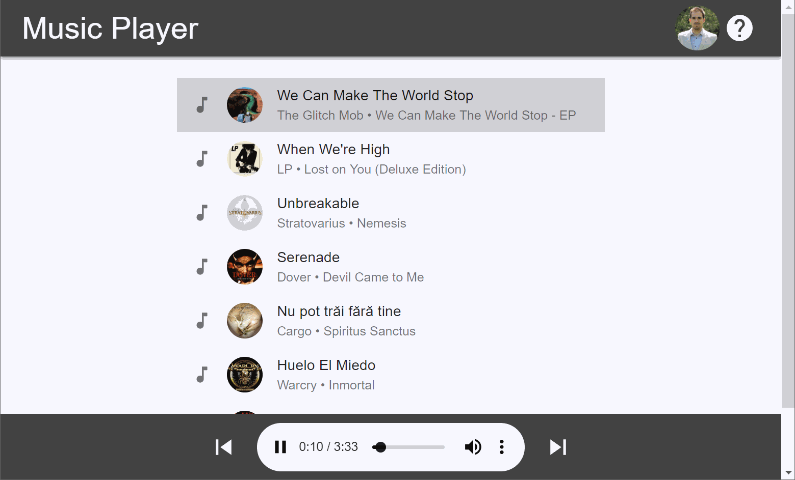

# musicplayer-ui

[](https://travis-ci.org/dsaltares/musicplayer-ui)
[](https://codecov.io/gh/dsaltares/musicplayer-ui)
[](https://sonarcloud.io/dashboard?id=dsaltares_musicplayer-ui)

Frontend for a simple music player app. You will find the backend in [dsaltares/musicplayer-server](https://github.com/dsaltares/musicplayer-server). It uses OAuth2 to get tracks in a `musicplayer` folder in your Google Drive account.

This project was bootstrapped with [Create React App](https://github.com/facebook/create-react-app).



## Setup

To get started, install the frontend dependencies.

```bash
npm install
```

## Tests and linting

The frontend uses [Jest](https://jestjs.io/) as its testing Framework, to run tests and get a coverage report you can simply:

```bash
npm run test
```

For linting.

```bash
npm run lint
```

## Running

Make sure you have an instance of [musicplayer-server](https://github.com/dsaltares/musicplayer-server) running and execute:

```bash
npm start
```

## Improvements

* Security
   * The client communicates with the server via http and stores Google credentials in local storage. They should be communicating via https and credentials should be stored in a [secured cookie](https://en.wikipedia.org/wiki/Secure_cookie).
   * The server should use [JWT](https://jwt.io/) so that the client can veriry the Google token and trust the server.
